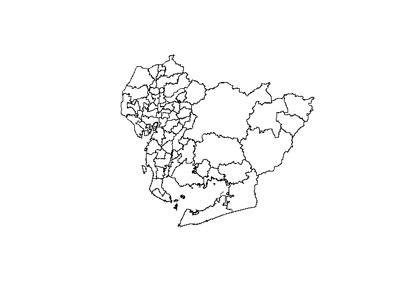

<!-- README.md is generated from README.Rmd. Please edit that file -->

# aichicities

<!-- badges: start -->
<!-- badges: end -->

aichicities is package provides the Aichi Prefecture administrative area
data in an easy-to-use format in R. These data are provided by the
[National Land Information
System](https://nlftp.mlit.go.jp/ksj/gml/datalist/KsjTmplt-N03-v3_1.html).
This package uses data in 2023 (Reiwa 5).

> aichicitiesは愛知県の行政区域データをRで扱いやすい形式で提供するパッケージです。
> これらのデータは[国土数値情報ダウンロードサービス](https://nlftp.mlit.go.jp/ksj/gml/datalist/KsjTmplt-N03-v3_1.html)によって提供されています。
> なお、このパッケージでは令和5年のデータを使用しています。

## Installation

You can install the development version of aichicities like so:

> aichicitiesの開発版は以下のようにインストールできます。

``` r
install.packages("remotes")
remotes::install_github("NONONOexe/aichicities")
```

## Usage

Load the package as follows:

> パッケージを以下のように読み込みます。

``` r
library(aichicities)
```

### Show district information

The package provides administrative district information in 2023 into
`tibble` format. You can show all the information as follows:

> このパッケージは2023年の行政区域データを`tibble`形式で提供します。
> 以下のようにして全ての情報を表示することができます。

``` r
aichi_districts
#> Simple feature collection with 69 features and 4 fields
#> Geometry type: GEOMETRY
#> Dimension:     XY
#> Bounding box:  xmin: 136.671 ymin: 34.57354 xmax: 137.8381 ymax: 35.42479
#> Geodetic CRS:  WGS 84
#> # A tibble: 69 × 5
#>    city_code city                   city_kanji    area                      geom
#>  * <chr>     <chr>                  <chr>        [m^2]             <POLYGON [°]>
#>  1 23101     Nagoya-shi Chikusa-ku  名古屋市 …  1.82e7 ((136.9857 35.19284, 136…
#>  2 23102     Nagoya-shi Higashi-ku  名古屋市 …  7.71e6 ((136.9073 35.18587, 136…
#>  3 23103     Nagoya-shi Kita-ku     名古屋市 …  1.75e7 ((136.9284 35.22506, 136…
#>  4 23104     Nagoya-shi Nishi-ku    名古屋市 …  1.79e7 ((136.9056 35.22525, 136…
#>  5 23105     Nagoya-shi Nakamura-ku 名古屋市 …  1.63e7 ((136.8813 35.17113, 136…
#>  6 23106     Nagoya-shi Naka-ku     名古屋市 …  9.38e6 ((136.9022 35.18605, 136…
#>  7 23107     Nagoya-shi Showa-ku    名古屋市 …  1.09e7 ((136.9167 35.13743, 136…
#>  8 23108     Nagoya-shi Mizuho-ku   名古屋市 …  1.12e7 ((136.9582 35.13567, 136…
#>  9 23109     Nagoya-shi Atsuta-ku   名古屋市 …  8.20e6 ((136.8958 35.14236, 136…
#> 10 23110     Nagoya-shi Nakagawa-ku 名古屋市 …  3.20e7 ((136.8083 35.16739, 136…
#> # ℹ 59 more rows
```

The package already provides the data, but you can also download the
original data using `download_aichi_district_data()` or read this using
`read_aichi_district_data()`.

> このパッケージではデータをすでに提供していますが、
> もとのデータを`download_aichi_district_data()`を使ってダウンロードしたり、
> `read_aichi_district_data()`を使って読み込むこともできます。

### Search districts

You can search the district information by part of the city name. The
search is available in both English and Japanese as follows:

> 市区町村の名前の一部から行政区域情報を検索することができます。
> この検索は次のように日本語と英語の両方に対応しています。

``` r
# Search districts by part of city name (en)
find_districts("Toyota")
#> Simple feature collection with 1 feature and 4 fields
#> Geometry type: POLYGON
#> Dimension:     XY
#> Bounding box:  xmin: 137.0397 ymin: 34.99061 xmax: 137.5811 ymax: 35.29116
#> Geodetic CRS:  WGS 84
#> # A tibble: 1 × 5
#>   city_code city       city_kanji       area                                geom
#>   <chr>     <chr>      <chr>           [m^2]                       <POLYGON [°]>
#> 1 23211     Toyota-shi 豊田市     918357182. ((137.3079 35.29059, 137.3081 35.2…

# Search districts by part of city name (jp)
find_districts("瀬戸")
#> Simple feature collection with 1 feature and 4 fields
#> Geometry type: POLYGON
#> Dimension:     XY
#> Bounding box:  xmin: 137.0486 ymin: 35.1788 xmax: 137.1895 ymax: 35.30165
#> Geodetic CRS:  WGS 84
#> # A tibble: 1 × 5
#>   city_code city     city_kanji       area                                  geom
#>   <chr>     <chr>    <chr>           [m^2]                         <POLYGON [°]>
#> 1 23204     Seto-shi 瀬戸市     111406877. ((137.1083 35.3001, 137.1083 35.3001…
```

### Plot administrative districts

You can easily create a map of Aichi Prefecture using the package. The
following code shows an example of creating a map of the entire Aichi
Prefecture and Nagoya City.

> このパッケージを使って愛知県の地図を簡単に作成することができます。
> 以下のコードは愛知県全体と名古屋市の地図を作成する例を示しています。

``` r
# Plot the all administrative districts of the entire Aichi Prefecture
plot(aichi_districts["geom"])
```



``` r
# Plot the administrative districts of Nagoya by size of area
plot(find_districts("Nagoya")["area"])
```


## Similar projects

- [uribo/jpndistrict](https://github.com/uribo/jpndistrict)
- [cran/NipponMap](https://github.com/cran/NipponMap)

## License

This project is licensed under the [Creative Commons Attribution 4.0
International License](https://creativecommons.org/licenses/by/4.0/).

> このプロジェクトは[クリエイティブ・コモンズ 表示 4.0 国際
> ライセンス](https://creativecommons.org/licenses/by/4.0/deed.ja)に従います。

## Code of Conduct

Please note that this project is released with a [Contributor Code of
Conduct](CODE_OF_CONDUCT.md). By participating in this project you agree
to abide by its terms.

> このプロジェクトは[行動規範](.github/CODE_OF_CONDUCT.md)を設けています。
> したがって、このプロジェクトでは参加者にこの行動規範に従うことを求めます。
